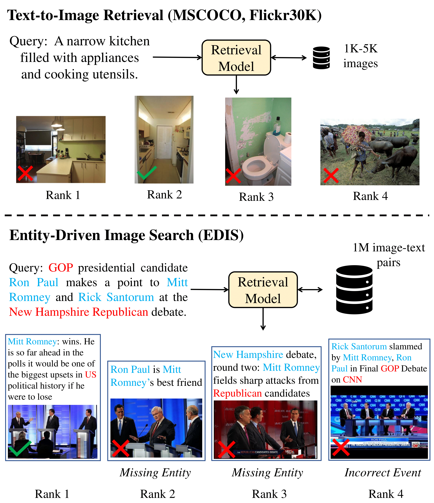

# EDIS: Entity-Driven Image Search over Multimodal Web Content
Arxiv: https://arxiv.org/abs/2305.13631

## Abstract
We introduce **E**ntity-**D**riven **I**mage **S**earch (EDIS), a challenging dataset for cross-modal image search in the news domain. EDIS consists of 1 million web images from actual search engine results and curated datasets, with each image paired with a textual description.  
Our experimental results show that EDIS challenges state-of-the-art methods with dense entities and a large-scale candidate set.




## Environment
```
git clone https://github.com/emerisly/EDIS.git
conda create -n edis
conda activate edis
pip install -r requirements.txt
```

## Datasets

1. Download edis image and unzip
```
curl -L 'https://cornell.box.com/shared/static/w6rnuk14plns7xs0po6ksxwwvxz6s76y.part00' --output edis_image.tar.gz.part00
curl -L 'https://cornell.box.com/shared/static/vi3hzcb340efh4fko8xtycjh1cn6r79g.part01' --output edis_image.tar.gz.part01
curl -L 'https://cornell.box.com/shared/static/92t2nl89q8wxf5kk0ds6reba2wp9jeqi.part02' --output edis_image.tar.gz.part02
```
2. Download edis json and unzip
```
curl -L 'https://cornell.box.com/shared/static/0aln48iy3wkvzg2iklczazmqdpdf83lc' --output edis_json.zip
```

## Training

1. Fine-tune  
update `image_root` in `retrieval_edis.yaml` to directory of edis image
```
CUDA_VISIBLE_DEVICES=0,1,2,3 python -m torch.distributed.run --nproc_per_node=4 --master_port=1234 train_edis.py \
--config ./configs/retrieval_edis.yaml \
--output_dir output/retrieval_edis_mblip_4gpus_5e-5
```

2. Evaluate  
update `image_root` in `retrieval_evaluate.yaml` to directory of edis image
```
python evaluate_retrieval.py --config configs/retrieval_evaluate.yaml --image_bank restricted --cuda 0
python compute_metrics.py -d output/evaluate_results
```

You can download the pre-trained and fine-tuned checkpoint from below

checkpoints | mBLIP w/ ViT-B | mBLIP w/ ViT-L |
:---: | :---: | :---: 
Pre-trained | <a href="https://storage.googleapis.com/sfr-vision-language-research/BLIP/models/model_base.pth">Download</a> | <a href="https://storage.googleapis.com/sfr-vision-language-research/BLIP/models/model_large.pth">Download</a> |
| Fine-tuned | - | <a href="https://cornell.box.com/shared/static/e2g6hb9mqacqyibvstwz2lyr2bo8r6ns.pth">Download</a>


## Citation
If you find this code useful for your research, please cite our paper:
```
@article{liu2023edis,
  title={EDIS: Entity-Driven Image Search over Multimodal Web Content},
  author={Liu, Siqi and Feng, Weixi and Chen, Wenhu and Wang, William Yang},
  journal={arXiv preprint arXiv:2305.13631},
  year={2023}
}
```

## Acknowledgement
We thank the authors of [TARA](https://github.com/zeyofu/TARA), [VisualNews](https://github.com/FuxiaoLiu/VisualNews-Repository), [BLIP](https://github.com/salesforce/BLIP/tree/main), [CLIP](https://github.com/openai/CLIP), and [Pyserini](https://github.com/castorini/pyserini) for their work and open-sourcing.