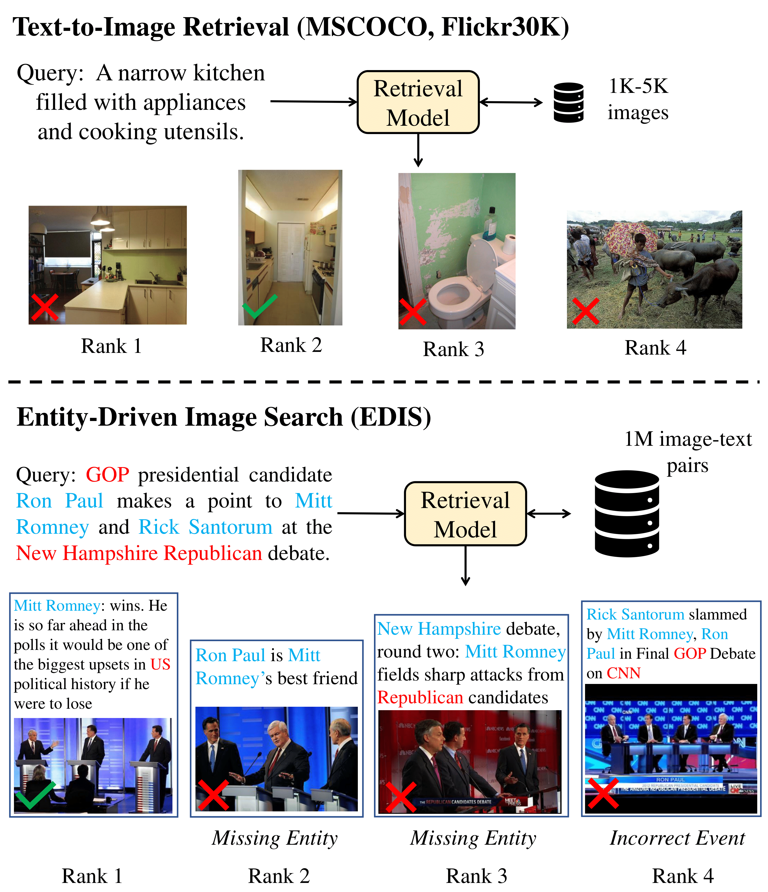

# EDIS: Entity-Driven Image Search over Multimodal Web Content
Arxiv link: https://arxiv.org/abs/2305.13631

## Abstract

Making image retrieval methods practical for real-world search applications requires significant progress in dataset scales, entity comprehension, and multimodal information fusion. In this work, we introduce **E**ntity-**D**riven **I**mage **S**earch (EDIS), a challenging dataset for cross-modal image search in the news domain. EDIS consists of 1 million web images from actual search engine results and curated datasets, with each image paired with a textual description. Unlike datasets that assume a small set of single-modality candidates, EDIS reflects real-world web image search scenarios by including a million multimodal image-text pairs as candidates. EDIS encourages the development of retrieval models that simultaneously address cross-modal information fusion and matching. To achieve accurate ranking results, a model must: 1) understand named entities and events from text queries, 2) ground entities onto images or text descriptions, and 3) effectively fuse textual and visual representations. Our experimental results show that EDIS challenges state-of-the-art methods with dense entities and a large-scale candidate set. The ablation study also proves that fusing textual features with visual features is critical in improving retrieval results.

## Datasets

Our dataset is available upon request. Please contact sl2322@cornell.edu

<!-- ### Citation -->
